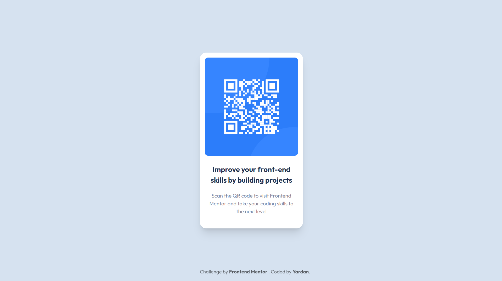

# Frontend Mentor - QR code component solution

This is a solution to the [QR code component challenge on Frontend Mentor](https://www.frontendmentor.io/challenges/qr-code-component-iux_sIO_H). Frontend Mentor challenges help you improve your coding skills by building realistic projects. 

## Table of contents

  - [Overview](#overview)
    - [Screenshot](#screenshot)
    - [Links](#links)
  - [My process](#my-process)
    - [Built with](#built-with)
    - [What I learned](#what-i-learned)
    - [Continued development](#continued-development)
    - [Useful resources](#useful-resources)
  - [Author](#author)
  - [Acknowledgments](#acknowledgments)

**Note: Delete this note and update the table of contents based on what sections you keep.**

## Overview

### Screenshot




### Links

- Solution URL: [Frontend Mentor - QR CODE](https://www.frontendmentor.io/solutions/react-qr-code-component-using-tailwind-css-ikvawY5IrM)
- Live Site URL: [QR CODE by Vercel](https://frontend-mentor-qr-code-phi.vercel.app/)

## My process

### Built with

- HTML5 markup
- Flexbox
- [React](https://reactjs.org/) - JS library
- [Tailwind CSS](https://reactjs.org/) - CSS Framework
- [Vite](https://vitejs.dev/) - Building Tools & Bundler
- [Vercel](https://vercel.com/) - PaaS


### What I learned

During the challenge process , i've learned how to using tailwind css in our project. We can start from install tailwind :

```
> npm install -D tailwindcss postcss autoprefixer
> npx tailwindcss init
```
the second command will create `postcss.config.cjs` and `tailwind.config.cjs` automaticly.

After two configuration files is created, we can start to config this file using the code below. The first code for `postcss.config.cjs` and the second for `tailwind.config.cjs`.

```js
module.exports = {
  plugins: {
    tailwindcss: {},
    autoprefixer: {},
  }
}
```

```js
module.exports = {
  content: [
    "./index.html",
    "./src/**/*.{jsx,js}"
  ],
  theme: {
    extend: {},
  },
  plugins: [],
}
```

And don't forget to config your main css file

```css
@tailwind base;
@tailwind components;
@tailwind utilities;
```

After you finished tailwind configuration you can start build process, it depeden on what package manager you are using.

```
pnpm run dev
```

## Author

  Frontend Mentor - [Yardan](https://www.frontendmentor.io/profile/morphiezy)
